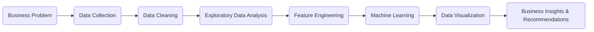

# Hi, I'm Ramanan G

### Data & Business Analyst | Business Analytics | Machine Learning | Data Visualization


I am an aspiring Data & Business Analyst pursuing an Integrated M.Tech in Computer Science and Engineering with a specialization in Business Analytics at VIT Chennai.

My interests lie in solving business problems using analytics, machine learning, business intelligence, and data visualization. I enjoy building end-to-end analytical solutions that convert raw data into actionable insights.

---

## About Me

- Integrated M.Tech in Computer Science & Engineering (Business Analytics)
- Passionate about Data Analytics, Business Intelligence, Machine Learning and AI
- Experienced in Python, SQL, Power BI, Tableau, BigQuery and Predictive Analytics
- Currently exploring Cloud Analytics, MLOps and Generative AI
- Looking for Data Analyst, Business Analyst and Analytics Consultant opportunities

---

## Technical Skills

### Programming Languages


---

### Data Analytics


---

### Machine Learning


---

### Databases


---

### Tools


---

# Featured Projects

## Banking Customer Risk & Revenue Intelligence System

End-to-end credit risk analytics platform built using Python, SQL, BigQuery and Machine Learning.

Highlights

- Processed 50,000+ banking transactions
- Automated ETL pipeline
- Engineered 15+ behavioral risk features
- Built Logistic Regression, Random Forest and Gradient Boosting models
- Achieved AUC-ROC greater than 0.88
- Integrated SHAP Explainability

**Tech Stack**

`Python` `SQL` `BigQuery` `Machine Learning` `SHAP`

---

## BMW Sales Analytics Dashboard

Interactive Power BI dashboard built using 50,000+ sales records.

Highlights

- Revenue Analytics
- Regional Sales Performance
- EV Market Share
- Executive KPI Dashboard
- Interactive Drill-down Filters

**Tech Stack**

`Power BI` `SQL` `Excel`

---

# Leadership

### Content Team Lead — Entrepreneurship Cell, VIT Chennai

- Led content strategy for a multidisciplinary student team
- Managed sprint planning using Jira
- Maintained project documentation using Confluence
- Coordinated with Design, Social Media and Event teams

---

# Achievements

- Indian Patent (IN202641054272 A1)
  - Geo-fenced Passenger Seat Occupancy Monitoring System Using Structured Image Analysis

- Winner — LIBATHON
  - Developed Shelf Scan Library Automation System

---

# Publications

### The Importance of Feature Engineering in Machine Learning

https://medium.com/@ramanan312004/the-importance-of-feature-engineering-in-machine-learning-ed95b6762dd4

---
---

## 🚀 Current Focus

> Building practical, business-driven analytics solutions that transform data into actionable insights.

| 🎯 Focus Area | 📈 Current Progress |
| :----------- | :----------------- |
| Production-ready Analytics Projects | 🔄 In Progress |
| Business Intelligence Dashboards | 🔄 In Progress |
| Machine Learning Applications | 🚀 Exploring |
| Cloud Analytics & Data Engineering | 📚 Learning |
| Data Analyst / Business Analyst Preparation | 💼 Actively Preparing |

---

## 📊 My Analytics Workflow



---

## 🧠 Areas of Interest

<table>
<tr>
<td width="50%">

### Analytics

- 📊 Business Analytics
- 📈 Data Analytics
- 📉 Business Intelligence
- 📋 Dashboard Development
- 📌 KPI Reporting

</td>

<td width="50%">

### AI & Engineering

- 🤖 Machine Learning
- ⚙️ Data Engineering
- 🗄️ SQL Development
- 📡 Predictive Analytics
- ✨ Generative AI

</td>
</tr>
</table>

---

## 🛠️ My Approach

```text
Understand the Business Problem
           │
           ▼
Acquire & Validate Data
           │
           ▼
Clean, Transform & Engineer Features
           │
           ▼
Analyze Patterns & Trends
           │
           ▼
Develop ML Models / Dashboards
           │
           ▼
Generate Actionable Business Insights
           │
           ▼
Support Better Decision Making
```

---

## 🌱 Currently Learning


---

> **"I enjoy transforming complex datasets into meaningful insights that enable smarter business decisions."**
---

# Connect With Me

[](https://www.linkedin.com/in/ramanan-g)

[](mailto:ramanan312004@gmail.com)

[](https://medium.com/@ramanan312004)

---

> "Turning data into decisions through analytics, machine learning and business intelligence."
